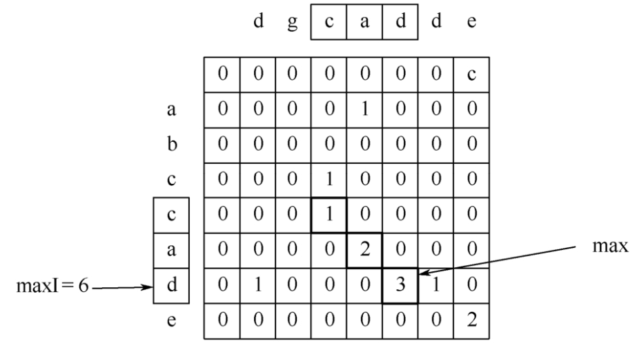
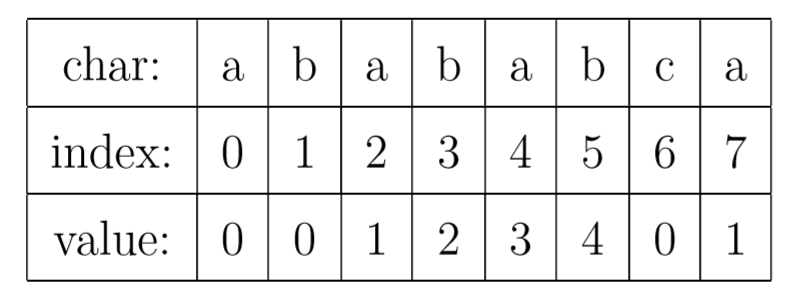
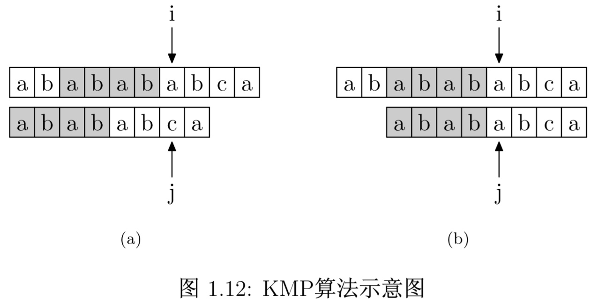
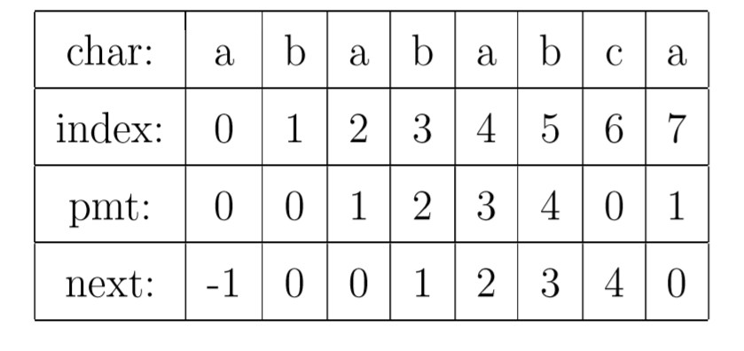

# 字符串

字符串是由数字、字母、下划线组成的一串字符。

- [字符串](#字符串)
	- [求一个字符串的所有排列](#求一个字符串的所有排列)
		- [递归法全排列](#递归法全排列)
	- [求两个字符串的最长公共子串](#求两个字符串的最长公共子串)
		- [动态规划法](#动态规划法)
		- [滑动比较法](#滑动比较法)
	- [对字符串进行反转](#对字符串进行反转)
		- [临时变量交换](#临时变量交换)
		- [异或法](#异或法)
	- [实现单词反转](#实现单词反转)
	- [判断两个字符串是否为换位字符串](#判断两个字符串是否为换位字符串)
	- [判断两个字符串的包含关系](#判断两个字符串的包含关系)
	- [对由大小写字母组成的字符数组排序](#对由大小写字母组成的字符数组排序)
	- [消除字符串的内嵌括号](#消除字符串的内嵌括号)
	- [判断字符串是否是整数](#判断字符串是否是整数)
	- [实现字符串的匹配](#实现字符串的匹配)
		- [循环遍历法](#循环遍历法)
		- [KMP 算法](#kmp-算法)
			- [实现计算 PMT 数组：](#实现计算-pmt-数组)
			- [实现计算 NEXT 数组：](#实现计算-next-数组)
	- [求字符串里的最长回文子串](#求字符串里的最长回文子串)
		- [中心扩展法](#中心扩展法)
	- [按照给定的字母序列对字符数组排序](#按照给定的字母序列对字符数组排序)
	- [判断一个字符串是否包含重复字符](#判断一个字符串是否包含重复字符)
	- [找到由其他单词组成的最长单词](#找到由其他单词组成的最长单词)
	- [统计字符串中连续重复字符的个数](#统计字符串中连续重复字符的个数)
	- [求最长递增子序列的长度](#求最长递增子序列的长度)
	- [求一个串中出现的第一个最长重复子串](#求一个串中出现的第一个最长重复子串)
	- [求解字符串中字典序最大的子序列](#求解字符串中字典序最大的子序列)
	- [求字符串的编辑距离](#求字符串的编辑距离)
	- [在二维数组中寻找最短路线](#在二维数组中寻找最短路线)
	- [截取包含中文的字符串](#截取包含中文的字符串)
	- [求相对路径](#求相对路径)
	- [查找到达目标词的最短链长度](#查找到达目标词的最短链长度)
	- [查找到达目标词的最短链长度](#查找到达目标词的最短链长度-1)
	- [查找到达目标词的最短链长度](#查找到达目标词的最短链长度-2)

## 求一个字符串的所有排列

实现一个方法，当输入一个字符串时，要求输出这个字符串的所有排列组合。例如输入字符串 abc，要求输出由字符 a、b、c 所能排列出来的所有字符串：abc， acb， bac， bca， cab， cba。

### 递归法全排列

1. 首先固定第一个字符 a，然后对后面的两个字符 b 与 c 进行全排列。
2. 交换第一个字符与其后面的字符，即交换 a 与 b，然后固定第一个字符 b，接着对后面的两个字符 a 与 c 进行全排列。
3. 由于第 2 步交换了 a 和 b 破坏了字符串原来的顺序，因此，需要再次交换 a 和 b 使其恢复到原来的顺序，然后交换第一个字符与第三个字符（交换 a 和 c），接着固定第一个字符 c，对后面的两个字符 a 与 b 进行全排列。


```go
func Permutation(s []rune, start int) {
	if s == nil {
		return
	}
	if start == len(s)-1 {
		result = append(result, string(s))
	} else {
		for i := start; i < len(s); i++ {
			s[start], s[i] = s[i], s[start]
			Permutation(s, start+1)
			s[start], s[i] = s[i], s[start]
		}
	}
}
```

## 求两个字符串的最长公共子串

找出两个字符串的最长公共子串，例如字符串 “abccade” 与字符串 “dgcadde” 的最长公共子串为 “cad”。

### 动态规划法



```go
func LongestSubStringDyn(s1, s2 []rune) (sub []rune) {
	l1, l2 := len(s1), len(s2)
	pos, max := 0, 0                 // 用来记录最长公共字串开始和结束字符的位置
	matrix := InitMatrix(l1+1, l2+1) // 申请新的空间来记录公共字串长度信息
	for i := 1; i < l1+1; i++ {
		for j := 1; j < l2+1; j++ {
			if s1[i-1] == s2[j-1] {
				matrix[i][j] = matrix[i-1][j-1] + 1
				if matrix[i][j] > pos {
					pos = matrix[i][j]
					max = i
				}
			} else {
				matrix[i][j] = 0
			}
		}
	}
	//PrintMatrix(matrix)
	return s1[max-pos : max]
}
```

由于这种方法使用了二重循环分别遍历两个字符数组，因此，时间复杂度为 `O(m*n)` （其中，m 和 n 分别为两个字符串的长度），此外，由于这种方法申请了一个 `m*n` 的二维数组，因此，算法的空间复杂度也为 `O(m*n)`。

### 滑动比较法

书上有这种方法的实现，但我自己思考半天想出了一种方法，可能与之差不多。

```go
func LongestSubString(s1, s2 []rune) (sub []rune) {
	p, q := 0, 0 // 记录最长子序列的开始和结束
	for k := 0; k < len(s2); k++ {
		i, j, x, y := 0, 0, 0, k         // 记录子序列的开始和结束
		for x < len(s1) && y < len(s2) { // 字符序列当前下标
			if s1[x] != s2[y] {
				if i != j { // 说明之前有过相同元素
					y = k // 必须重置起始位置
				} else {
					x++
				}
				i, j = x, x
			} else {
				j, x, y = j+1, x+1, y+1
			}
			// 判断当前子序列是否更长
			if j-i > q-p {
				q, p = j, i
			}
		}
	}
	return s1[p:q]
}
```

动态规划法性能略差。

```
BenchmarkLongestSubStringDyn-8            299994              3650 ns/op            9344 B/op         34 allocs/op
BenchmarkLongestSubString-8               630778              1994 ns/op               0 B/op          0 allocs/op
```

## 对字符串进行反转

### 临时变量交换

```go
func main() {
	s := []rune("abcdefg")
	front, rear := 0, len(s)-1
	for front < rear {
		s[front], s[rear] = s[rear], s[front]
		front++
		rear--
	}
	fmt.Println(string(s))
}
```

### 异或法

```go
func main() {
	s := []rune("abcdefg")
	front, rear := 0, len(s)-1
	for front < rear {
		s[front] = s[rear] ^ s[front]
		s[rear] = s[rear] ^ s[front]
		s[front] = s[rear] ^ s[front]
		front++
		rear--
	}
	fmt.Println(string(s))
}
```

这种方法只需要对字符数组遍历一次，因此，时间复杂度为O(n)（n为字符串的长度），与方法一相比，这种方法在实现字符交换的时候不需要额外的变量。

## 实现单词反转

```go
func main() {
	s := []rune("how about you")

	ReverseString(s)
	start := 0
	for i := range s {
		if s[i] == ' ' {
			ReverseString(s[start:i])
			start = i + 1
		}
	}
	ReverseString(s[start:])

	fmt.Println(string(s))
}

func ReverseString(s []rune) []rune {
	front, rear := 0, len(s)-1
	for front < rear {
		s[front] = s[rear] ^ s[front]
		s[rear] = s[rear] ^ s[front]
		s[front] = s[rear] ^ s[front]
		front++
		rear--
	}
	return s
}
```

## 判断两个字符串是否为换位字符串

换位字符串是指组成字符串的字符相同，但位置不同。例如，字符串“aaaabbc”与字符串“abcbaaa”就是由相同的字符所组成的，因此，它们是换位字符。

```go
func Compare(s1, s2 string) bool {
	if len(s1) != len(s2) {
		return false
	}
	dict := make(map[uint8]int)
	for i := range s1 {
		dict[s1[i]] += 1
		dict[s2[i]] -= 1
	}
	for i := range dict {
		if dict[i] != 0 {
			return false
		}
	}
	return true
}
```

## 判断两个字符串的包含关系

给定由字母组成的字符串 s1 和 s2，其中，s2 中字母的个数少于 s1，如何判断 s1 是否包含 s2？

方法与上一题相同，简单修改即可。

```go
func Contain(s1, s2 string) bool {
	if len(s1) < len(s2) {
		return false
	}
	dict := make(map[uint8]int)
	for i := range s1 {
		dict[s1[i]] += 1
		dict[s2[i]] -= 1
	}
	for i := range dict {
		if dict[i] < 0 {
			return false
		}
	}
	return true
}
```

## 对由大小写字母组成的字符数组排序

有一个由大小写字母组成的字符串，请对它进行重新组合，使得其中的所有小写字母排在大写字母的前面（大写或小写字母之间不要求保持原来次序）。

```go
func sortLetter(s []byte) []byte {
	front, rear := 0, len(s)-1
	for front < rear {
		for s[front] >= 'a' { // A 65 / a 97
			front++
		}
		for s[rear] < 'a' {
			rear--
		}
		if front < rear {
			s[front], s[rear] = s[rear], s[front]
		}
	}
	return s
}
```

## 消除字符串的内嵌括号

```go
func RemoveNested(s []byte) (ret []byte) {
	if s[0] != '(' || s[len(s)-1] != ')' {
		panic("invalid format")
	}
	ret = append(ret, '(')
	brackets := 0
	for i := range s {
		if s[i] == '(' {
			brackets++
		} else if s[i] == ')' {
			brackets--
		} else {
			ret = append(ret, s[i])
		}
	}
	if brackets != 0 {
		panic("invalid format")
	}
	return append(ret, ')')
}
```

## 判断字符串是否是整数

```go
func IsInteger(s string) (int, bool) {
	if s == "" {
		return 0, false
	}
	neg := 1
	if s[0] == '+' {
		s = s[1:]
	} else if s[0] == '-' {
		s = s[1:]
		neg = -1
	}
	var n uint8
	for i := range s {
		if s[i] < '0' || s[i] > '9' {
			return 0, false
		}
		n = n*10 + s[i] - '0'
	}
	return neg * int(n), true
}
```

## 实现字符串的匹配

给定主字符串 s 与模式字符串 p，判断 p 是否是 s 的子串，如果是，则找出 p 在 s 中第一次出现的下标。

### 循环遍历法

```go
func IsSubString(s, sub string) (start int, ret bool) {
	if len(s) < len(sub) {
		return -1, false
	}
	i, j := 0, 0
	for i < len(s) && j < len(sub) {
		for i < len(s) && s[i] != sub[j] {
			i++
		}
		if i == len(s) {
			return -1, false
		}
		start = i
		for i < len(s) && j < len(sub) && s[i] == sub[j] {
			i, j = i+1, j+1
		}
		if j == len(sub) {
			break
		}
		if i == len(s) {
			return -1, false
		}
		i, j = start+1, 0
	}
	return start, true
}
```

### KMP 算法

前一种方法一旦字符串不匹配，模式串需要回退到 0，主串需要回退到 i-j+1 的位置重新开始下一次比较。而在 KMP 算法中，如果不匹配，不需要回退，即 i 保持不动，j 也不用清零，而是向右滑动模式串，继续匹配。这种方法的核心就是确定 K 的大小，显然，K 的值越大越好。

KMP 算法的核心，是一个被称为部分匹配表 Partial Match Table 的数组。

对于字符串“abababca”，它的 PMT 如下表所示：



如果字符串 A 和 B，存在 A=BS，其中 S 是任意的**非空**字符串，那就称 B 为 A 的前缀。例如，”Harry”的前缀包括 {”H”, ”Ha”, ”Har”, ”Harr”}，我们把所有前缀组成的集合，称为字符串的前缀集合。同样可以定义后缀 A=SB， 其中 S 是任意的**非空**字符串，那就称 B 为 A 的后缀，例如，”Potter”的后缀包括{”otter”, ”tter”, ”ter”, ”er”, ”r”}，然后把所有后缀组成的集合，称为字符串的后缀集合。

PMT 中的值是字符串的**前缀集合与后缀集合的交集**中最长元素的长度。



将 PMT 数组向后偏移一位，新得到的这个数组称为 next 数组。



#### 实现计算 PMT 数组：

```go
func Pmt(s string) []int {
	pmt := make([]int, len(s))
	pmt[0] = 0
	for i, j := 1, 0; i < len(s); {
		if s[i] == s[j] {
			pmt[i] = pmt[i-1] + 1
			i, j = i+1, j+1
		} else if j == 0 {
			i++
		} else {
			// 从两边扫描对称值
			x, y := 0, i
			for s[x] == s[y] {
				x, y = x+1, y-1
			}
			pmt[i] = x
			i, j = i+1, x
		}
	}
	return pmt
}
```

#### 实现计算 NEXT 数组：

```go
func Next(s string) []int {
	next := make([]int, len(s)+1)
	next[0]=-1
	for i, j := 0, -1; i < len(s); {
		if j == -1 || s[i] == s[j] {
			i, j = i+1, j+1
			next[i] = j
		} else {
			j = next[j]
		}
	}
	return next
}
```

PMT 和 NEXT 都是求的都是子字符串的，我陷入了误区。

```go
func IsSubStringKMP(s, sub string) (start int, ret bool) {
	if len(s) < len(sub) {
		return -1, false
	}
	next := Next(sub)
	i, j := 0, 0
	for i < len(s) && j < len(sub) {
		if j == -1 || s[i] == sub[j] {
			j++
		} else {
			j = next[j]
		}
		i++
	}
	if j == len(sub) {
		return i - len(sub), true
	}
	return -1, false
}
```

## 求字符串里的最长回文子串

回文字符串是指一个字符串从左到右与从右到左遍历得到的序列是相同的。

### 中心扩展法

从字符串最中间的字符开始向两边扩展，通过比较左右两边字符是否相等就可以确定这个字符串是否为回文字符串。这种方法对于字符串长度为奇数和偶数的情况需要分别对待。

```go

```

## 按照给定的字母序列对字符数组排序

```go

```

## 判断一个字符串是否包含重复字符

```go

```

## 找到由其他单词组成的最长单词

```go

```

## 统计字符串中连续重复字符的个数

```go

```

## 求最长递增子序列的长度

```go

```

## 求一个串中出现的第一个最长重复子串

```go

```

## 求解字符串中字典序最大的子序列

```go

```

## 求字符串的编辑距离

```go

```

## 在二维数组中寻找最短路线

```go

```

## 截取包含中文的字符串

```go

```

## 求相对路径

```go

```

## 查找到达目标词的最短链长度

```go

```

## 查找到达目标词的最短链长度

```go

```

## 查找到达目标词的最短链长度

```go

```

```go

```

```go

```

